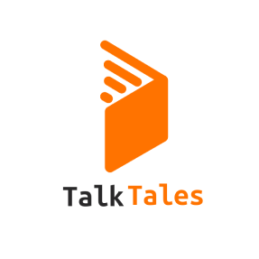

# Talk Tales

    

TalkTales is an English learning app that combines the learning experience with folklore. Users will become one of the characters in the folktale and are required to recite the conversation in English in order to proceed to the next story. This application uses an AI model to detect the user's speech.

### Abstract
Indonesia ranks 81st in English proficiency among 111 nations as per the 2022 EF Education First English Proficiency Index. Addressing this, our project seeks to bolster English language skills through innovative learning methods. Common obstacles in English mastery—limited vocabulary, grammatical inaccuracies, pronunciation issues, and insufficient practice—are targeted for improvement. In the current global landscape, Indonesian youth are increasingly disconnected from their cultural roots, with a noticeable waning in folklore interest. This trend threatens the erosion of ancestral knowledge and national identity. To counteract this, our initiative emphasizes the dual goals of enhancing English fluency and cultural reconnection.

## About the team
1. - <a href="https://www.linkedin.com/in/dandi-lesmana-b52b3122b">Dandi Lesmana</a> as CC-11
2. - <a href="https://www.linkedin.com/in/muhammad-luthfi-irfan">Muhammad Luthfi Irfan</a> as CC-28
3. - <a href="https://www.linkedin.com/in/tan-nicholas-octavian-wijaya/">Tan Nicholas Octavian Wijaya</a> as ML-77
4. - <a href="https://www.linkedin.com/in/xuchinn">Xuchin Valezka</a> as ML- 72
5. - <a href="https://www.linkedin.com/in/mraflidwis/">Muhammad Rafli Dwi Sutrisno</a> as ML
6. - <a href="https://www.linkedin.com/in/achmad-faqih-suyudi-a540b026a/">Achmad Faqih Suyudi</a> as MD-03
7. - <a href="https://www.linkedin.com/in/muhammad-nabhan-rifa-i/ ">Muhammad Nabhan Rifa’i</a> as MD-09

## Resources

### Dataset
- <a href="https://www.kaggle.com/datasets/awsaf49/ljspeech-sr16k-dataset/code">LJ Speech</a>
- <a href="https://www.kaggle.com/datasets/tannicholasdummy/talktales-public">DIY Dataset</a>

### Figma
- <a href="https://www.figma.com/design/MgWuxx6vAtQenNnXJ7bJro/Draft-UI-Capstone?node-id=2%3A3&t=KhqhGy29NhOkX4kD-1">Talk Tales UI Design File</a>

### Repository
- <a href="https://github.com/talk-tales/Android-Talk-Tales">Android</a>
- <a href="https://github.com/talk-tales/service-model">Model Service Backend</a>
- <a href="https://github.com/talk-tales/CC-Backend">Talk Tales Backend</a>
- <a href="https://github.com/talk-tales/CC-Backend">Talk Tales Backend</a>

### Project Document
- <a href="https://docs.google.com/document/d/11luJc1QGAnd6ucHL_YkwhH3f767V9NrI4KQnVKtNI2s/edit">Project Plan</a>
- <a href="https://docs.google.com/document/d/1jTGoh84FSeA4d8yXROtY-hOp7759mhn3EZLpLIIfXRM/edit?usp=sharing">Project Brief</a>
- <a href="https://youtube.coms">Showcase Video</a>
    